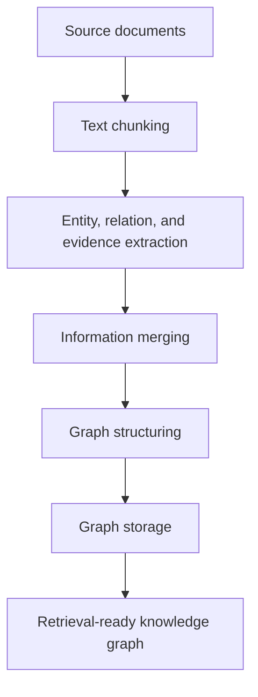

<div align="center">

# DeepBreeding

### A Knowledge-Integrated Platform for Evidence-Traceable Crop Breeding Report Generation

<p>
  <a href="#citation"></a>
  <a href="https://deepbreeding.com"></a>
  <a href="https://github.com/zhiweihu1103/DeepBreeding/tree/main/breeding_literature_crawler"></a>
  <a href="https://github.com/HKUDS/LightRAG"></a>
  <a href="https://github.com/hiyouga/LlamaFactory"></a>
  <a href="https://github.com/EleutherAI/lm-evaluation-harness"></a>
</p>

**DeepBreeding** generates structured, evidence-supported, and traceable crop breeding reports from breeding-related scientific questions.

It integrates literature collection, knowledge graph construction, knowledge retrieval, knowledge distillation, and benchmark-based evaluation for interpretable crop breeding reasoning across staple crops and minor cereals.

</div>

---

## Contents

- [Overview](#overview)
- [At a Glance](#at-a-glance)
- [Workflow](#workflow)
- [Core Modules](#core-modules)
- [Benchmark and Results](#benchmark-and-results)
- [Repository Map](#repository-map)
- [Quick Start](#quick-start)
- [Citation](#citation)

---

## Overview

Crop breeding knowledge is scattered across scientific literature, public databases, and long-term breeding records. This fragmentation limits rapid evidence integration for gene function, regulatory mechanisms, phenotype associations, and practical breeding recommendations.

DeepBreeding addresses this challenge by organizing breeding knowledge into reusable knowledge graphs, retrieving question-relevant evidence, distilling reasoning patterns into deployable small language models, and evaluating performance with breeding-oriented benchmark tasks.

---

## At a Glance

| Item | Value |
|---|---:|
| Staple crop publications | 41,089 |
| Minor cereal publications | 9,829 |
| Staple crop KG | 84,668 entities / 248,244 edges |
| Minor cereal KG | 38,252 entities / 116,983 edges |
| Benchmark tasks | 10 single-choice QA tasks |
| Staple crop gain | 45.18% → 65.06% |
| Minor cereal gain | 53.70% → 79.51% |

---

## Workflow


DeepBreeding reports are designed to include problem interpretation, integrated evidence, mechanistic analysis, validation pathways, and traceable evidence sources.

---

## Core Modules

| Module | Role | Implementation |
|---|---|---|
| 📚 **Literature Collection** | Retrieve and curate breeding-related literature for staple crops and minor cereals. | [DeepBreeding literature crawler](https://github.com/zhiweihu1103/DeepBreeding/tree/main/breeding_literature_crawler) |
| 🧬 **Knowledge Graph Construction** | Convert literature and breeding records into entity-relation-evidence graphs. | [LightRAG](https://github.com/HKUDS/LightRAG) |
| 🏋️ **Model Training** | Distill LLM reasoning into deployable small language models with instruction tuning. | [LLaMA-Factory](https://github.com/hiyouga/LlamaFactory) |
| 📊 **Model Evaluation** | Evaluate breeding knowledge reasoning across standardized benchmark tasks. | [lm-evaluation-harness](https://github.com/EleutherAI/lm-evaluation-harness) |

### 1. Literature Collection

The paper systematically retrieves and curates breeding-related literature from PubMed, bioRxiv, and other public resources. Search terms focus on gene expression, transcription factors, and breeding-relevant biological evidence. The retrieval scope covers publications up to **December 1, 2025**.

| Crop group | Species |
|---|---|
| Staple crops | *Oryza sativa*, *Triticum aestivum*, *Zea mays* |
| Minor cereals and related crops | *Avena sativa*, *Coix lacryma-jobi*, *Fagopyrum esculentum*, *Hordeum vulgare*, *Lens culinaris*, *Pisum sativum*, *Setaria italica*, *Sorghum bicolor*, *Vigna angularis*, *Vigna radiata*, *Vigna unguiculata* |

```text
https://github.com/zhiweihu1103/DeepBreeding/tree/main/breeding_literature_crawler
```

### 2. Knowledge Graph Construction

DeepBreeding uses a two-stage strategy integrating automated construction and proportional manual validation. The automated workflow includes document input, text chunking, information extraction, information merging, graph structuring, and graph storage.



The paper describes extraction of genetic, phenotypic, regulatory, environmental, methodological, and experimental knowledge units. Entities, relations, and evidence descriptions are retained for downstream retrieval and traceable reasoning.

Quality control samples 5% of entities and edges across entity and relation types to inspect entity boundaries, categories, relation semantics, and evidence consistency.

### 3. Model Training

DeepBreeding trains small language models through knowledge distillation and instruction tuning. GPT-5.2 is used in the paper to generate structured training samples containing a task instruction, breeding question, retrieved evidence, reasoning process, and reference answer.

Training is performed with [LLaMA-Factory](https://github.com/hiyouga/LlamaFactory) using LoRA.

| Setting | Value |
|---|---|
| Adaptation method | LoRA |
| Target modules | all linear modules |
| LoRA rank / alpha / dropout | 8 / 16 / 0 |
| Learning rate | 1.0e-4 |
| Epochs | 3 |
| Scheduler | cosine |
| Warm-up ratio | 0.1 |
| Precision | bfloat16 |

### 4. Model Evaluation

DeepBreeding uses a breeding-oriented benchmark with **10 single-choice question-answering tasks** across four knowledge categories.

| Category | Tasks |
|---|---|
| Gene-Level Feature Identification | Gene Structural Domains; Chromosomal Localization of Genes |
| Regulatory Mechanism Interpretation | Cis-Regulatory Elements; Trans-Acting Factors; Functional Validation of Regulatory Elements |
| Gene Function and Systems-Level Validation | Functional Genomics; Systems Genetics; Gain- and Loss-of-Function Validation |
| Gene-Phenotype Association Reasoning | Association Between Homologous Genes and Phenotypes; Gene Effects and Phenotypic Associations |

The evaluation compares General LLMs, Reasoning LLMs, General SLMs, and General SLMs enhanced with DeepBreeding.

---

## Benchmark and Results

| Benchmark | General SLMs | General SLMs + DeepBreeding | Gain |
|---|---:|---:|---:|
| Staple crops | 45.18% | 65.06% | +19.88 |
| Minor cereals | 53.70% | 79.51% | +25.81 |

Key observations from the paper:

- DeepBreeding improves small language model performance in both staple crop and minor cereal benchmarks.
- The gain is stronger in minor cereals, where literature coverage and species-specific knowledge are sparser.
- Cross-task, cross-species, and cross-category analyses suggest transferable functional evidence, regulatory knowledge, and gene-phenotype association information.
- Knowledge graphs preserve entities, relations, and evidence descriptions for traceable downstream reasoning.

---

## Repository Map

```text
DeepBreeding/
├── breeding_literature_crawler/      # Literature retrieval for KG construction
├── knowledge_graph/                  # LightRAG-based KG construction workflow
├── training/                         # LLaMA-Factory configs and training scripts
├── evaluation/                       # lm-evaluation-harness tasks and evaluation scripts
├── data/                             # KG data, benchmark data, and source data links
└── README.md
```

> The literature crawler has already been released at `breeding_literature_crawler`. The knowledge graph, model training, and evaluation modules are organized around the external open-source frameworks linked above.

---

## Quick Start

### 1. Collect Literature

```bash
git clone https://github.com/zhiweihu1103/DeepBreeding.git
cd DeepBreeding/breeding_literature_crawler
```

Use the crawler-specific instructions to reproduce literature retrieval and abstract collection.

### 2. Build the Knowledge Graph

```bash
git clone https://github.com/HKUDS/LightRAG.git
```

Use curated literature abstracts and breeding records as source documents, then run the LightRAG-based workflow for chunking, extraction, merging, graph structuring, and storage.

### 3. Train DeepBreeding Models

```bash
git clone https://github.com/hiyouga/LlamaFactory.git
```

Prepare instruction-tuning samples with retrieved evidence and reference answers, then run LoRA-based supervised fine-tuning using the hyperparameters reported above.

### 4. Evaluate Models

```bash
git clone https://github.com/EleutherAI/lm-evaluation-harness.git
```

Register the 10 DeepBreeding benchmark tasks, run inference over candidate models, and compute accuracy with unified task instructions and answer-matching rules.

---

## Citation

If you use DeepBreeding, please cite:

```bibtex
@article{hu2026deepbreeding,
  title   = {DeepBreeding: A Knowledge-Integrated Platform for Evidence-Traceable Crop Breeding Report Generation},
  author  = {Hu, Zhiwei and Yang, Yi and Guti\\'errez Basulto, V\\'ictor and Deng, Yuanpei and Yang, Senjie and Yan, Zhichao and Li, Ru and Xie, Qianqian and Pan, Jeff Z. and Gao, Jianhua and Kong, Zhaosheng},
  year    = {2026},
  note    = {Manuscript}
}
```

---

## Links

| Resource | URL |
|---|---|
| Platform | https://deepbreeding.com |
| Literature crawler | https://github.com/zhiweihu1103/DeepBreeding/tree/main/breeding_literature_crawler |
| LightRAG | https://github.com/HKUDS/LightRAG |
| LLaMA-Factory | https://github.com/hiyouga/LlamaFactory |
| lm-evaluation-harness | https://github.com/EleutherAI/lm-evaluation-harness |
vvvvvvvvvvvvvvvvvvvvvvvvvvvvvvvvvvvvvvvvvvvvvvvvvv
