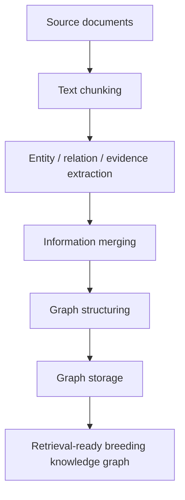

<div align="center">

# DeepBreeding

### A Knowledge-Integrated Platform for Evidence-Traceable Crop Breeding Report Generation

[](#citation)
[](https://deepbreeding.com)
[](https://github.com/HKUDS/LightRAG)
[](https://github.com/hiyouga/LlamaFactory)
[](https://github.com/EleutherAI/lm-evaluation-harness)

**DeepBreeding** is an AI-driven framework for generating structured, evidence-supported, and traceable crop breeding reports from breeding-related scientific questions.

It integrates literature collection, knowledge graph construction, knowledge retrieval, knowledge distillation, and benchmark-based evaluation to support interpretable crop breeding reasoning across staple crops and minor cereals.

</div>

---

## Overview

Crop breeding knowledge is scattered across scientific literature, public databases, and long-term breeding records. This fragmentation makes it difficult to integrate evidence for gene function, regulatory mechanisms, phenotype associations, and practical breeding recommendations.

DeepBreeding addresses this challenge through a closed-loop workflow:


The platform is designed around four core capabilities described in the paper:

| Module | Icon | Purpose | Open-source component |
|---|---:|---|---|
| Literature retrieval | 📚 | Collect staple crop and minor cereal literature for knowledge graph construction | [DeepBreeding literature crawler](https://github.com/zhiweihu1103/DeepBreeding/tree/main/breeding_literature_crawler) |
| Knowledge graph construction | 🧬 | Convert breeding literature and records into searchable entity-relation-evidence graphs | [LightRAG](https://github.com/HKUDS/LightRAG) |
| Model training | 🏋️ | Distill LLM reasoning into deployable small language models using instruction tuning | [LLaMA-Factory](https://github.com/hiyouga/LlamaFactory) |
| Model evaluation | 📊 | Evaluate breeding knowledge reasoning across benchmark tasks | [lm-evaluation-harness](https://github.com/EleutherAI/lm-evaluation-harness) |

---

## What DeepBreeding Produces

DeepBreeding generates structured breeding reports with:

- **Problem interpretation**: the breeding objective, crop context, and biological scope.
- **Integrated evidence**: retrieved evidence from knowledge graphs, PubMed, and web resources.
- **Mechanistic analysis**: gene function, regulation, phenotype association, and biological mechanism reasoning.
- **Validation pathways**: suggested experimental, molecular, population, and field validation routes.
- **Traceable sources**: literature, graph evidence, and online references supporting each conclusion.

---

## 1. Literature Collection

**Goal:** retrieve and curate breeding-related literature for staple crop and minor cereal knowledge graph construction.

The paper reports systematic retrieval from PubMed, bioRxiv, and other public resources. Search terms focus on gene expression, transcription factors, and breeding-relevant biological evidence.

### Crop Scope

**Staple crops**

- *Oryza sativa*
- *Triticum aestivum*
- *Zea mays*

**Minor cereals and related crops**

- *Avena sativa*
- *Coix lacryma-jobi*
- *Fagopyrum esculentum*
- *Hordeum vulgare*
- *Lens culinaris*
- *Pisum sativum*
- *Setaria italica*
- *Sorghum bicolor*
- *Vigna angularis*
- *Vigna radiata*
- *Vigna unguiculata*

### Literature Scale

| Corpus | Publications |
|---|---:|
| Staple crops | 41,089 |
| Minor cereals | 9,829 |

The retrieval scope in the paper covers publications up to **December 1, 2025**.

Code for this module is available at:

```text
https://github.com/zhiweihu1103/DeepBreeding/tree/main/breeding_literature_crawler
```

---

## 2. Knowledge Graph Construction

**Goal:** organize heterogeneous crop breeding knowledge into structured, searchable, and evidence-preserving graphs.

DeepBreeding uses an automated construction workflow inspired by GraphRAG principles and implemented with [LightRAG](https://github.com/HKUDS/LightRAG). The workflow integrates unstructured and semi-structured texts from literature abstracts and breeding-related records.

### Construction Workflow



The paper describes extraction of major genetic, phenotypic, regulatory, environmental, methodological, and experimental knowledge units. Entities, relations, and evidence descriptions are retained to support downstream retrieval and traceable reasoning.

### Knowledge Graph Scale

| Knowledge graph | Entities | Edges |
|---|---:|---:|
| Staple crop KG | 84,668 | 248,244 |
| Minor cereal KG | 38,252 | 116,983 |

### Quality Control

The paper uses proportional manual validation: 5% of entities and edges are randomly sampled across entity and relation types to inspect entity boundaries, categories, relation semantics, and consistency with supporting evidence.

---

## 3. Model Training

**Goal:** transfer crop-breeding reasoning ability from large language models into lightweight small language models for practical deployment.

DeepBreeding trains small language models through knowledge distillation and instruction tuning. According to the paper, GPT-5.2 is used to generate structured training samples containing:

- task instruction
- breeding question
- retrieved evidence
- reasoning process
- reference answer

Training is performed with [LLaMA-Factory](https://github.com/hiyouga/LlamaFactory) using parameter-efficient LoRA adaptation.

### Training Configuration Reported in the Paper

| Setting | Value |
|---|---|
| Adaptation method | LoRA |
| Target modules | all linear modules |
| LoRA rank | 8 |
| LoRA alpha | 16 |
| LoRA dropout | 0 |
| Learning rate | 1.0e-4 |
| Epochs | 3 |
| Scheduler | cosine |
| Warm-up ratio | 0.1 |
| Precision | bfloat16 |

The training objective is to enable small language models to generate breeding reports with evidence-supported reasoning while reducing deployment cost.

---

## 4. Model Evaluation

**Goal:** quantify whether DeepBreeding improves breeding knowledge understanding, evidence integration, and traceable reasoning.

The evaluation workflow is implemented with [lm-evaluation-harness](https://github.com/EleutherAI/lm-evaluation-harness). The benchmark contains **10 single-choice question-answering tasks** across four knowledge categories.

### Benchmark Categories

| Category | Tasks |
|---|---|
| Gene-Level Feature Identification | Gene Structural Domains; Chromosomal Localization of Genes |
| Regulatory Mechanism Interpretation | Cis-Regulatory Elements; Trans-Acting Factors; Functional Validation of Regulatory Elements |
| Gene Function and Systems-Level Validation | Functional Genomics; Systems Genetics; Gain- and Loss-of-Function Validation |
| Gene-Phenotype Association Reasoning | Association Between Homologous Genes and Phenotypes; Gene Effects and Phenotypic Associations |

### Model Groups

| Group | Description |
|---|---|
| General LLMs | General-purpose LLM baselines without crop-breeding-specific adaptation |
| Reasoning LLMs | LLMs with explicit or enhanced reasoning mechanisms |
| General SLMs | Lightweight small language models without DeepBreeding enhancement |
| General SLMs + DeepBreeding | Small language models enhanced with knowledge graph, retrieval, and distillation |

### Reported Benchmark Gains

| Benchmark | General SLMs | General SLMs + DeepBreeding | Gain |
|---|---:|---:|---:|
| Staple crops | 45.18% | 65.06% | +19.88 |
| Minor cereals | 53.70% | 79.51% | +25.81 |

These results show stronger gains in knowledge-sparse minor cereal scenarios, where structured retrieval and distilled reasoning help compensate for uneven literature coverage.

---

## Repository Map

This repository is intended to provide reproducible entry points for the DeepBreeding workflow:

```text
DeepBreeding/
├── breeding_literature_crawler/      # Literature retrieval for KG construction
├── knowledge_graph/                  # LightRAG-based KG construction workflow
├── training/                         # LLaMA-Factory configs and training scripts
├── evaluation/                       # lm-evaluation-harness tasks and evaluation scripts
├── data/                             # KG data, benchmark data, and source data links
└── README.md
```

> Note: the literature crawler has already been released at `breeding_literature_crawler`. The knowledge graph, model training, and evaluation modules are organized around the external open-source frameworks linked above.

---

## Quick Start

### 1. Collect Literature

Use the literature crawler to retrieve breeding-related records for target crops:

```bash
git clone https://github.com/zhiweihu1103/DeepBreeding.git
cd DeepBreeding/breeding_literature_crawler
```

Follow the crawler-specific instructions to reproduce literature retrieval and abstract collection.

### 2. Build the Knowledge Graph

Install and configure LightRAG:

```bash
git clone https://github.com/HKUDS/LightRAG.git
```

Use the curated literature abstracts and breeding records as source documents, then run the LightRAG-based pipeline for chunking, extraction, merging, graph structuring, and storage.

### 3. Train DeepBreeding Models

Install LLaMA-Factory:

```bash
git clone https://github.com/hiyouga/LlamaFactory.git
```

Prepare instruction-tuning samples with retrieved evidence and reference answers, then run LoRA-based supervised fine-tuning using the hyperparameters reported above.

### 4. Evaluate Models

Install lm-evaluation-harness:

```bash
git clone https://github.com/EleutherAI/lm-evaluation-harness.git
```

Register the 10 DeepBreeding benchmark tasks, run inference over candidate models, and compute accuracy with unified task instructions and answer-matching rules.

---

## Key Findings

- DeepBreeding links knowledge organization, retrieval, model adaptation, and evaluation into a closed-loop framework for crop breeding report generation.
- Knowledge graph construction preserves entities, relations, and evidence descriptions for traceable downstream reasoning.
- Knowledge-enhanced small language models substantially improve performance over general SLM baselines.
- Minor cereal benchmarks benefit especially from DeepBreeding, reflecting the value of retrieval and structured knowledge in sparse-evidence settings.
- Cross-task, cross-species, and cross-category analyses suggest that functional evidence, regulatory knowledge, and gene-phenotype associations can transfer across breeding contexts.

---

## Citation

If you use DeepBreeding, please cite:

```bibtex
@article{hu2026deepbreeding,
  title   = {DeepBreeding: A Knowledge-Integrated Platform for Evidence-Traceable Crop Breeding Report Generation},
  author  = {Hu, Zhiwei and Yang, Yi and Guti\\'errez Basulto, V\\'ictor and Deng, Yuanpei and Yang, Senjie and Yan, Zhichao and Li, Ru and Xie, Qianqian and Pan, Jeff Z. and Gao, Jianhua and Kong, Zhaosheng},
  year    = {2026},
  note    = {Manuscript}
}
```

---

## Links

- 🌐 Platform: https://deepbreeding.com
- 📚 Literature crawler: https://github.com/zhiweihu1103/DeepBreeding/tree/main/breeding_literature_crawler
- 🧬 LightRAG: https://github.com/HKUDS/LightRAG
- 🏋️ LLaMA-Factory: https://github.com/hiyouga/LlamaFactory
- 📊 lm-evaluation-harness: https://github.com/EleutherAI/lm-evaluation-harness
